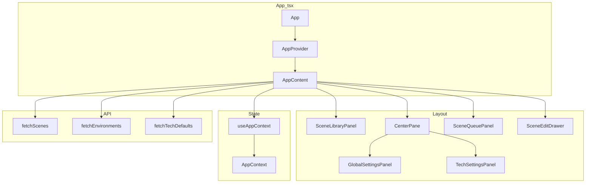
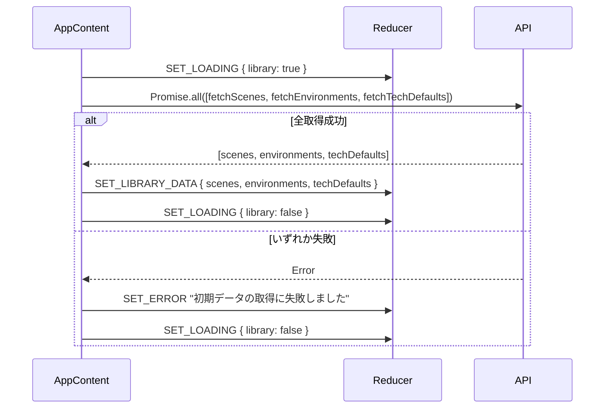

# 設計書: frontend-render-fix

## Overview

`App.tsx` がプレースホルダー実装のままであるため、実装済みの全コンポーネント（`SceneLibraryPanel`、`GlobalSettingsPanel`、`TechSettingsPanel`、`SceneQueuePanel`、`SceneEditDrawer`）が画面に表示されない。本修正はこの配線の欠落を解消し、3ペインレイアウトによる完全な画面表示を実現する。

変更対象は `frontend/src/App.tsx` の1ファイルのみ。全コンポーネント・状態管理・API クライアントはすでに実装済みであり、`App.tsx` を正しく実装することで動作が回復する。

### Goals
- `AppProvider` による状態管理コンテキストの提供
- アプリ起動時の API からの初期データ自動取得（シーン・環境・技術デフォルト値）
- 3ペインレイアウト（左: シーンライブラリ、中央: 設定、右: キュー）の表示
- `SceneEditDrawer` のオーバーレイ表示

### Non-Goals
- 各パネルコンポーネント内部の実装変更
- CSS フレームワークの導入
- `reducer.ts` へのアクション追加・変更
- レスポンシブデザイン対応

---

## Requirements Traceability

| 要件 | 概要 | コンポーネント | インターフェース | フロー |
|------|------|---------------|-----------------|--------|
| 1.1 | AppProvider でラップ | `App` | `AppProvider` | — |
| 1.2 | AppContext を子へ提供 | `App`, `AppContent` | `useAppContext` | — |
| 1.3 | Provider 外エラー（既実装） | `AppContext` | — | — |
| 2.1 | マウント時に3API呼び出し | `AppContent` | `fetchScenes`, `fetchEnvironments`, `fetchTechDefaults` | 初期データ取得フロー |
| 2.2 | 取得中に `library: true` | `AppContent` | `SET_LOADING` | 初期データ取得フロー |
| 2.3–2.5 | 取得成功時に `SET_LIBRARY_DATA` | `AppContent` | `SET_LIBRARY_DATA` | 初期データ取得フロー |
| 2.6 | 取得失敗時に `SET_ERROR` | `AppContent` | `SET_ERROR` | 初期データ取得フロー |
| 3.1–3.5 | 3ペインレイアウト表示 | `AppContent` | — | — |
| 4.1–4.3 | SceneEditDrawer オーバーレイ | `AppContent` | `SceneEditDrawerProps` | — |

---

## Architecture

### Existing Architecture Analysis

現在の `App.tsx` はプレースホルダーであり、状態管理・コンポーネント接続がすべて欠落している。修正後は以下の構造になる：

- `App.tsx` 単一ファイル内に `App`（root）と `AppContent`（内部コンポーネント）を定義
- `AppContent` が `useAppContext()` を介して状態・dispatch にアクセスし、データ取得とレイアウトを担当
- 2コンポーネント構造は `useAppContext()` が `AppProvider` 内でのみ呼べるという React の制約から導出される

### Architecture Pattern & Boundary Map



**Architecture Integration**:
- 選択パターン: Option A（`App.tsx` のみ修正）。変更1ファイルで全要件を満たす
- 既存パターン維持: インラインスタイル、`useAppContext`、`useReducer`
- 新コンポーネント: `AppContent`（`App.tsx` 内部、非エクスポート）— `useAppContext()` の制約に対応するため

### Technology Stack

| Layer | Choice / Version | Role | Notes |
|-------|-----------------|------|-------|
| UI Framework | React 18.2 | コンポーネントレンダリング、`useEffect`/`useState` | 既存。StrictMode により開発環境で useEffect が2回実行される（System Flows 参照） |
| 状態管理 | React Context + `useReducer` | アプリ全体の状態 | 既存 (`AppContext.tsx`) |
| スタイリング | インラインスタイル + グローバル CSS リセット | 3ペインレイアウト | `index.html` に `body { margin: 0; padding: 0 }` を追加してビューポート全体を占有させる（要件 3.1） |
| API 通信 | `fetch` (Vite proxy) | `/api/*` → `localhost:8080` | 既存 (`client.ts`) |
| テスト | Vitest + @testing-library/react | ユニット・統合テスト | 既存 |

---

## System Flows

### 初期データ取得フロー



フロー設計の判断:
- `Promise.all` を使用することで3つのAPIを並列に呼び出し、最速で初期表示できる
- 一つでも失敗した場合は全体エラーとして扱い、`SET_LIBRARY_DATA` は呼ばない（部分的な状態を防ぐ）
- `SET_LOADING { library: false }` は成功・失敗どちらでも `finally` で実行する

> **React StrictMode 注意事項**: `main.tsx` が `<StrictMode>` でラップしているため、React 18 の開発環境では `useEffect` が mount → unmount → mount の順に2回実行される。その結果、`Promise.all` による API 呼び出しが2回発火する。2回目の結果が最終的な state に残るため動作上の問題はないが、開発環境のネットワークタブで二重リクエストが見えることを認識しておく。`dispatch` は `useReducer` が安定参照を保証するため、この二重実行は副作用を持たない。

---

## Components and Interfaces

### コンポーネント概要

| Component | Domain/Layer | Intent | Req Coverage | Key Dependencies | Contracts |
|-----------|-------------|--------|-------------|------------------|-----------|
| `App` | Root | AppProvider のマウント | 1.1, 1.2 | `AppProvider` (P0) | — |
| `AppContent` | Root / Shell | データ取得・レイアウト・ドロワー統合 | 1.2, 2.1–2.6, 3.1–3.5, 4.1–4.3 | `useAppContext` (P0), 全パネル (P0) | State |
| `SceneLibraryPanel` | UI | シーン一覧表示（既実装） | 3.2 | `useAppContext` (P0) | — |
| `GlobalSettingsPanel` | UI | グローバル設定（既実装） | 3.3 | `useAppContext` (P0) | — |
| `TechSettingsPanel` | UI | 技術設定（既実装） | 3.3 | `useAppContext` (P0) | — |
| `SceneQueuePanel` | UI | キュー表示・生成（既実装） | 3.4 | `useAppContext` (P0) | — |
| `SceneEditDrawer` | UI / Overlay | シーン編集ドロワー（既実装） | 4.1–4.3 | `dispatch` (P0) | — |

既実装の UI コンポーネント（`SceneLibraryPanel` 等）は新たな境界を導入しないため、概要行のみ記載する。

---

### Root Layer

#### `App`

| Field | Detail |
|-------|--------|
| Intent | `AppProvider` でアプリ全体をラップする root コンポーネント |
| Requirements | 1.1, 1.2 |

**Responsibilities & Constraints**
- `AppProvider` をマウントし、その子として `AppContent` をレンダリングする
- 自身は状態・API・レイアウトに関知しない

**Dependencies**
- Outbound: `AppProvider` (`AppContext.tsx`) — 状態管理コンテキストの提供 (P0)
- Outbound: `AppContent` (同ファイル内) — 実際のUI表示 (P0)

**Contracts**: State [x]

##### State Management

- State model: `AppProvider` に委譲（`App` 自身は状態を持たない）
- Persistence & consistency: React `useReducer` による同期的状態管理
- Concurrency strategy: 単一スレッド（React のイベントループに委譲）

**Implementation Notes**
- `App.tsx` 内に `AppContent` を定義し、非エクスポートとする
- `App` はデフォルトエクスポートとし、`main.tsx` の呼び出し方を変更しない

---

#### `AppContent`

| Field | Detail |
|-------|--------|
| Intent | `useAppContext` を通じて状態にアクセスし、初期データ取得・3ペインレイアウト・`SceneEditDrawer` の統合を担当する内部コンポーネント |
| Requirements | 1.2, 2.1–2.6, 3.1–3.5, 4.1–4.3 |

**Responsibilities & Constraints**
- `useEffect` によるアプリ起動時の初期データ取得（一度のみ）
- `flexbox` による3ペインレイアウトのレンダリング
- `SceneEditDrawer` へ必要な props を state から組み立てて渡す
- `App.tsx` 内部の非公開コンポーネント（エクスポートしない）

**Dependencies**
- Inbound: `AppProvider` — コンテキスト提供 (P0)
- Outbound: `fetchScenes`, `fetchEnvironments`, `fetchTechDefaults` (`client.ts`) — 初期データ取得 (P0)
- Outbound: `SceneLibraryPanel`, `GlobalSettingsPanel`, `TechSettingsPanel`, `SceneQueuePanel` — レイアウト構成 (P0)
- Outbound: `SceneEditDrawer` — オーバーレイ表示 (P0)

**Contracts**: State [x]

##### State Management

- State model: `useAppContext()` で `state` と `dispatch` を取得

```typescript
// AppContent が扱う状態の型（既存 AppState から抜粋）
interface AppContentStateSlice {
  drawerState: DrawerState          // isOpen, sceneId
  sceneQueue: SceneQueueItem[]      // sceneId からシーンを検索
  techDefaults: TechDefaults | null // SceneEditDrawer の defaults
}
```

- Persistence & consistency: `useReducer` の同期的状態更新に委譲
- Concurrency strategy: `useEffect` の依存配列を空配列 `[]` として初回マウント時のみ実行

**Implementation Notes**
- Integration:
  - `useEffect(..., [dispatch])` 内で `dispatch({ type: 'SET_LOADING', payload: { library: true } })` → `Promise.all` → 成功時 `SET_LIBRARY_DATA` → `finally` で `SET_LOADING { library: false }`。依存配列は `[dispatch]` とする（`dispatch` は `useReducer` が安定参照を保証するため `[]` と等価だが、`react-hooks/exhaustive-deps` lint ルール違反を防ぐために明示する）
  - `SceneEditDrawer` に渡す `scene` は `state.sceneQueue.find(item => item.id === state.drawerState.sceneId) ?? null`
  - `SceneEditDrawer` に渡す `defaults` は `state.techDefaults?.workflowConfig.defaultPrompts ?? EMPTY_DEFAULT_PROMPTS`
- Validation:
  - `EMPTY_DEFAULT_PROMPTS` を `AppContent` 内定数として定義し、`techDefaults` が `null` の場合のフォールバックとする（型安全性の確保）
- Risks:
  - `Promise.all` 中の一部失敗で全データが未設定になるが、エラー表示で利用不可を明示するため許容する

---

##### SceneEditDrawer への Props 組み立て

```typescript
// AppContent 内での組み立てロジック（型定義）
interface SceneEditDrawerProps {
  isOpen: boolean           // state.drawerState.isOpen
  scene: SceneQueueItem | null  // state.sceneQueue.find(i => i.id === state.drawerState.sceneId) ?? null
  defaults: DefaultPrompts  // state.techDefaults?.workflowConfig.defaultPrompts ?? EMPTY_DEFAULT_PROMPTS
  dispatch: Dispatch<AppAction>  // useAppContext().dispatch
}

// フォールバック定数（型安全性のため）
const EMPTY_DEFAULT_PROMPTS: DefaultPrompts = {
  basePositivePrompt: '',
  environmentPrompt: '',
  positivePrompt: '',
  negativePrompt: '',
  batchSize: 1,
}
```

---

## Error Handling

### Error Strategy

初期データ取得エラーのみを扱う。各パネル内部のエラー処理は既実装。

### Error Categories and Responses

**System Errors（初期データ取得失敗）**:
- `Promise.all` のいずれかが失敗 → `SET_ERROR` アクションで `state.error` に文字列をセット
- `SceneLibraryPanel` は `state.error` が非 null の場合、既に `<div role="alert">{error}</div>` を表示する実装済み
- `SET_LOADING { library: false }` を `finally` で確実に呼び、ローディング状態が残留しないようにする

### Monitoring

エラーは `state.error` としてUIに表示する。サーバーサイドのログ収集は本スコープ外。

---

## Testing Strategy

### Unit Tests（`App.test.tsx` を新規作成）

1. `App` コンポーネントが `AppProvider` でラップされた状態でレンダリングされることを検証
2. マウント時に `fetchScenes`・`fetchEnvironments`・`fetchTechDefaults` が各1回呼ばれることをモックで検証
3. 初期データ取得成功時に3ペインの各パネルが表示されることを検証
4. 初期データ取得失敗時にエラーが表示され、ローディング状態が解消されることを検証

### Integration Tests

5. `SceneLibraryPanel` のシーンカードをクリックすると `SceneQueuePanel` にアイテムが追加されることを検証（ `AppProvider` 経由の状態共有確認）
6. キュー内のシーン編集ボタンをクリックすると `SceneEditDrawer` が表示されることを検証

### テストパターン

- APIモック: `vi.mock('../../api/client')` で `fetchScenes`・`fetchEnvironments`・`fetchTechDefaults` をスタブ化
- 既存パターン: `@testing-library/react` の `render`・`screen`・`act` を使用（`AppContext.test.tsx` と同じパターン）
