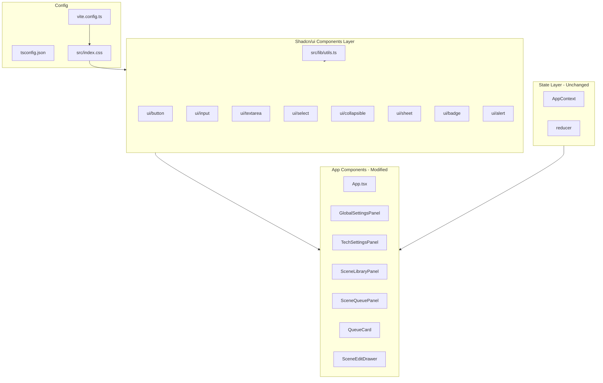
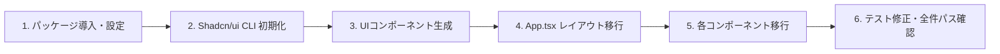

# 技術設計書: web-ui-styling

## 概要

**目的**: 現在スタイル未適用の ComfyUI Prompt Maker フロントエンドに Shadcn/ui（Tailwind CSS v4 + Radix UI ベース）を導入し、ユーザーが直感的に操作できるビジュアルデザインを実現する。

**対象ユーザー**: ComfyUI のワークフロー設定を構築するコンテンツクリエイター。既存の3ペインレイアウト（グローバル設定 / シーンライブラリ / シーンキュー）を維持しつつ、各UI要素にスタイルを適用する。

**影響範囲**: フロントエンドのみ。バックエンド API・状態管理ロジック・型定義は変更なし。設定ファイル（`vite.config.ts`, `tsconfig.json`）と全コンポーネントファイルが対象。

### Goals
- Tailwind CSS v4 + Shadcn/ui の導入と設定完了
- 全既存コンポーネントへの統一されたスタイル適用
- 既存テストスイートのすべてが引き続きパスすること
- アクセシビリティ属性（ARIA ロール・ラベル・フォーカスリング）の維持

### Non-Goals
- バックエンドロジックの変更
- 状態管理（AppContext / reducer）の変更
- 新機能の追加（ダークモード切り替えなど）
- レスポンシブ対応（モバイルレイアウト）

---

## アーキテクチャ

### 既存アーキテクチャ分析

現在のフロントエンドは React 18 + TypeScript + Vite 5 で構成されており、スタイルライブラリは一切導入されていない。コンポーネントはインラインスタイル（`style={{ ... }}`）またはブラウザデフォルトスタイルのみを使用している。

- **レイアウト**: `App.tsx` にインラインスタイルで3カラムフレックスレイアウトを定義
- **ドロップダウン**: `GlobalSettingsPanel` は `<button>` + `<ul>` で独自実装
- **ドロワー**: `SceneEditDrawer` は `position: fixed` の独自オーバーレイ実装
- **ボタン・入力**: 標準 HTML 要素（スタイルなし）

### Architecture Pattern & Boundary Map



**アーキテクチャ統合**:
- 選択パターン: UIコンポーネントライブラリ（ローカル生成型）— Shadcn/ui は npm パッケージではなく CLI でソースコードを生成するため、プロジェクト固有のカスタマイズが可能
- 既存パターンの維持: AppContext/reducer による状態管理、API クライアント、型定義はすべて変更なし
- 新規コンポーネント: `src/components/ui/` 配下の Shadcn/ui 生成コンポーネントと `src/lib/utils.ts`

### Technology Stack

| レイヤー | 選択 / バージョン | 本フィーチャーでの役割 | 備考 |
|---|---|---|---|
| スタイルフレームワーク | Tailwind CSS v4 + `@tailwindcss/vite` | ユーティリティクラスによるスタイリング基盤 | CSS ファースト設定、`tailwind.config.js` 不要 |
| UIコンポーネント | Shadcn/ui (latest) | アクセシブルなUIコンポーネント群の提供 | Radix UI ベース、ローカル生成型 |
| Radix UI ランタイム | `radix-ui` (unified, 2026/02〜) | Select, Collapsible, Sheet のアクセシビリティ実装 | CLI が自動選択 |
| クラスユーティリティ | `clsx` + `tailwind-merge` + `class-variance-authority` | 条件付きクラス生成、重複クラス排除 | `cn()` helper 経由で使用 |
| アイコン | `lucide-react` | Collapsible の chevron、削除ボタンのアイコン | Shadcn/ui 依存パッケージ |
| アニメーション | `tw-animate-css` | Sheet/Select のオープン/クローズアニメーション | `tailwindcss-animate` の後継 |

---

## 要件トレーサビリティ

| 要件 | 概要 | コンポーネント | インターフェース | フロー |
|---|---|---|---|---|
| 1.1–1.5 | UIライブラリ導入・設定 | 設定レイヤー、`src/lib/utils.ts` | `cn()` 関数 | — |
| 2.1–2.5 | グローバルスタイル・レイアウト | `App.tsx` | — | — |
| 3.1–3.6 | GlobalSettingsPanel スタイル | `GlobalSettingsPanel` | `Input`, `Select` props | — |
| 4.1–4.6 | TechSettingsPanel スタイル | `TechSettingsPanel` | `Collapsible`, `Input` props | — |
| 5.1–5.6 | SceneLibraryPanel スタイル | `SceneLibraryPanel` | `Alert` props | — |
| 6.1–6.6 | SceneQueuePanel スタイル | `SceneQueuePanel` | `Button`, `Alert` props | 生成フロー |
| 7.1–7.6 | QueueCard スタイル | `QueueCard` | `Badge`, `Button` props | — |
| 8.1–8.8 | SceneEditDrawer スタイル | `SceneEditDrawer` | `Sheet`, `Input`, `Textarea`, `Button` props | ドロワー開閉 |
| 9.1–9.4 | アクセシビリティ維持 | 全コンポーネント | ARIA 属性 | — |

---

## コンポーネントとインターフェース

### コンポーネント概要

| コンポーネント | ドメイン/レイヤー | 役割 | 要件カバレッジ | 主要依存 | コントラクト |
|---|---|---|---|---|---|
| 設定レイヤー (vite.config.ts等) | インフラ | Tailwind/Shadcn の設定統合 | 1.1–1.5 | `@tailwindcss/vite`, `@types/node` | — |
| `src/lib/utils.ts` | ユーティリティ | `cn()` ヘルパー提供 | 1.4 | `clsx`, `tailwind-merge` | Service |
| Shadcn UIコンポーネント群 (`src/components/ui/`) | UIライブラリ | 再利用可能なスタイル済みコンポーネント | 1.4, 3–8 | `radix-ui`, `class-variance-authority` | State |
| `App.tsx` | レイアウト | 3カラムフレックスレイアウト | 2.3–2.5 | Tailwind utility classes | — |
| `GlobalSettingsPanel` | フィーチャーUI | キャラクター名入力・環境選択 | 3.1–3.6 | `Input`, `Select` | State |
| `TechSettingsPanel` | フィーチャーUI | 技術設定アコーディオン | 4.1–4.6 | `Collapsible`, `Input` | State |
| `SceneLibraryPanel` | フィーチャーUI | シーンカード一覧 | 5.1–5.6 | `Alert` | State |
| `SceneQueuePanel` | フィーチャーUI | キュー管理・生成ボタン | 6.1–6.6 | `Button`, `Alert` | State |
| `QueueCard` | フィーチャーUI | キューアイテムカード | 7.1–7.6 | `Badge`, `Button` | — |
| `SceneEditDrawer` | フィーチャーUI | シーン編集ドロワー | 8.1–8.8 | `Sheet`, `Input`, `Textarea`, `Button` | State |

---

### 設定レイヤー

#### 設定ファイル群

| フィールド | 詳細 |
|---|---|
| Intent | Tailwind CSS v4 と Shadcn/ui を Vite プロジェクトに統合する設定変更 |
| Requirements | 1.1, 1.2, 1.3 |

**変更対象ファイルと変更内容**

`vite.config.ts`:
- `@tailwindcss/vite` プラグインを `plugins` に追加
- `path.resolve(__dirname, "./src")` を `@` エイリアスとして `resolve.alias` に追加
- 既存の `server.proxy` と `test` 設定は変更なし

`tsconfig.json`:
- `compilerOptions` に `"baseUrl": "."` と `"paths": { "@/*": ["./src/*"] }` を追加
- 既存の `strict: true`, `noUnusedLocals: true` 等は変更なし

`src/index.css`:
- `@import "tailwindcss"` を先頭に追加（`npx shadcn@latest init` が CSS変数・テーマ設定も自動生成）

**依存**
- External: `@tailwindcss/vite` — Tailwind v4 Vite プラグイン (P0)
- External: `@types/node` — `path.resolve` の型定義 (P0)

**Contracts**: Service [ ] / API [ ] / Event [ ] / Batch [ ] / State [ ]

**Implementation Notes**
- `PostCSS` 設定ファイル（`postcss.config.js`）は作成しない（`@tailwindcss/vite` プラグインと競合するため）
- `npx shadcn@latest init` 実行時に `components.json` が自動生成される（`style: "new-york"`, `rsc: false`, `tsx: true`）

---

### ユーティリティレイヤー

#### `src/lib/utils.ts`

| フィールド | 詳細 |
|---|---|
| Intent | Tailwind クラスの条件結合・重複排除ユーティリティ `cn()` を提供する |
| Requirements | 1.4, 1.5 |

**Contracts**: Service [x] / API [ ] / Event [ ] / Batch [ ] / State [ ]

##### Service Interface
```typescript
import { type ClassValue, clsx } from 'clsx'
import { twMerge } from 'tailwind-merge'

export function cn(...inputs: ClassValue[]): string
```
- 事前条件: なし（空引数も許容）
- 事後条件: 重複・競合する Tailwind クラスが解決された文字列を返す
- 不変条件: 入力値が `undefined` / `null` の場合は無視される

**Implementation Notes**
- `npx shadcn@latest init` で自動生成されるため手動作成は不要
- 全 Shadcn/ui コンポーネントがこの関数に依存する

---

### Shadcn/ui コンポーネント群 (`src/components/ui/`)

CLI コマンド `npx shadcn@latest add input button select collapsible sheet badge alert textarea` で生成される。各ファイルはプロジェクトローカルに配置され、完全なカスタマイズが可能。

| コンポーネント | ファイル | エクスポート | 要件 |
|---|---|---|---|
| Button | `ui/button.tsx` | `Button`, `ButtonProps`, `buttonVariants` | 6.1, 7.4, 8.6 |
| Input | `ui/input.tsx` | `Input` | 3.2, 4.4, 8.3, 8.5 |
| Textarea | `ui/textarea.tsx` | `Textarea` | 8.4 |
| Select | `ui/select.tsx` | `Select`, `SelectTrigger`, `SelectValue`, `SelectContent`, `SelectItem` | 3.3, 3.4, 3.5 |
| Collapsible | `ui/collapsible.tsx` | `Collapsible`, `CollapsibleTrigger`, `CollapsibleContent` | 4.1, 4.2, 4.3 |
| Sheet | `ui/sheet.tsx` | `Sheet`, `SheetContent`, `SheetHeader`, `SheetTitle`, `SheetFooter`, `SheetClose` | 8.1, 8.2 |
| Badge | `ui/badge.tsx` | `Badge`, `badgeVariants` | 7.3 |
| Alert | `ui/alert.tsx` | `Alert`, `AlertDescription` | 5.5, 6.2, 6.3, 6.4 |

これらは Radix UI ベースのアクセシブルコンポーネントであり、既存の ARIA 属性要件（9.1–9.4）を標準で満たす。

**Implementation Notes**
- `Button` の `variant` prop: `"default"` (プライマリ), `"ghost"` (アイコンボタン), `"destructive"` (削除)
- `Sheet` の `SheetContent` は `side="right"` を指定してサイドパネルとして使用
- `Select` はポータルを使用してドロップダウンをレンダリング（テストでの注意事項は research.md 参照）

---

### アプリコンポーネント層

#### `App.tsx`

| フィールド | 詳細 |
|---|---|
| Intent | 3カラムレイアウトをインラインスタイルから Tailwind クラスに移行する |
| Requirements | 2.3, 2.4, 2.5 |

**変更内容**: インラインスタイル（`style={{ display: 'flex', ... }}`）を `className` に移行。左右ペインの `flex: '0 0 300px'` は `w-[300px] shrink-0`、中央ペインの `flex: 1` は `flex-1` で表現する。

---

#### `GlobalSettingsPanel`

| フィールド | 詳細 |
|---|---|
| Intent | 環境選択をカスタムドロップダウンから Shadcn/ui Select に置き換え、Input コンポーネントでキャラクター名入力をスタイル適用する |
| Requirements | 3.1, 3.2, 3.3, 3.4, 3.5, 3.6 |

**変更内容**:
- `useState(isDropdownOpen)` と `<button>` + `<ul role="listbox">` の実装を削除
- Shadcn/ui `Select` + `SelectTrigger` + `SelectContent` + `SelectItem` に置き換え
- `<input>` → `<Input>` コンポーネント（ラベルと `id` の紐付けは維持）
- セクション見出し（"グローバル設定"）を `<h2>` + Tailwind typography クラスで追加

**依存**
- Outbound: `ui/input.tsx` — Input コンポーネント (P0)
- Outbound: `ui/select.tsx` — Select コンポーネント (P0)
- Inbound: `AppContext` — environments, globalSettings (P0)

**Contracts**: Service [ ] / API [ ] / Event [ ] / Batch [ ] / State [x]

**Implementation Notes**
- `Select` の `onValueChange` コールバックで `dispatch({ type: 'SELECT_ENVIRONMENT', ... })` を呼び出す。`value` は `env.name`（ユニークキー）を使用
- 環境サムネイル画像は `SelectItem` 内にインライン要素として配置（Radix の `SelectItem` は任意の children を受け入れる）
- 既存テスト (`GlobalSettingsPanel.test.tsx`) は Select の新しい DOM 構造（portal）に対応した書き換えが必要な場合がある

---

#### `TechSettingsPanel`

| フィールド | 詳細 |
|---|---|
| Intent | アコーディオン展開を Shadcn/ui Collapsible に置き換え、全入力フィールドを Input コンポーネントでスタイル適用する |
| Requirements | 4.1, 4.2, 4.3, 4.4, 4.5, 4.6 |

**変更内容**:
- `useState(isExpanded)` と `<button>` を `Collapsible` + `CollapsibleTrigger` + `CollapsibleContent` に置き換え
- 展開インジケータ（"▼/▶"）を `lucide-react` の `ChevronDown` / `ChevronRight` アイコンに置き換え
- 全 `<input>` → `<Input>` コンポーネント（`htmlFor`/`id` 紐付け維持）
- `<fieldset>` + Tailwind ボーダースタイルで ComfyUI 設定とワークフロー設定をグループ化

**Contracts**: Service [ ] / API [ ] / Event [ ] / Batch [ ] / State [x]

---

#### `SceneLibraryPanel`

| フィールド | 詳細 |
|---|---|
| Intent | シーン一覧をカード形式に変更し、ローディング・エラー・空状態に Shadcn/ui スタイルを適用する |
| Requirements | 5.1, 5.2, 5.3, 5.4, 5.5, 5.6 |

**変更内容**:
- 各シーン `<button>` を Tailwind カード（`border rounded-lg shadow-sm`）スタイルのラッパー + ホバーエフェクトに変更
- エラー表示 `<div role="alert">` → `Alert` + `AlertDescription`
- ローディング・空状態表示に Tailwind テキストスタイルを適用
- `role="list"` と `aria-label` は維持

**Contracts**: Service [ ] / API [ ] / Event [ ] / Batch [ ] / State [x]

---

#### `SceneQueuePanel`

| フィールド | 詳細 |
|---|---|
| Intent | 生成ボタンをプライマリ Button に変更し、エラー表示を Alert に、ローディング中のボタン無効状態を追加する |
| Requirements | 6.1, 6.2, 6.3, 6.4, 6.5, 6.6 |

**変更内容**:
- `<button onClick={handleGenerate}>` → `<Button onClick={handleGenerate} disabled={state.loadingState.generating}>` （生成中は disabled + ローディングインジケータ表示）
- 3種のエラー表示（`emptyQueueError`, `missingTechFields`, `generateError`）→ それぞれ `Alert` + `AlertDescription`
- 空状態テキストに Tailwind スタイルを適用

**Contracts**: Service [ ] / API [ ] / Event [ ] / Batch [ ] / State [x]

**Implementation Notes**
- ローディング状態は `state.loadingState.generating` を `Button` の `disabled` prop に渡す
- ボタン内にスピナーアイコン（`lucide-react` の `Loader2`）を条件表示することでローディング中の視覚フィードバックを提供

---

#### `QueueCard`

| フィールド | 詳細 |
|---|---|
| Intent | キューアイテムをカード形式にし、オーバーライドバッジを Badge コンポーネントで表示し、削除ボタンをアイコンボタン化する |
| Requirements | 7.1, 7.2, 7.3, 7.4, 7.5, 7.6 |

**変更内容**:
- ルート `<div>` に Tailwind カードスタイル（`border rounded-md bg-card p-3`）を適用
- `data-modified` に応じた左ボーダーカラーをインラインスタイルから Tailwind 条件クラスに移行
- `<span>` バッジ → `Badge` コンポーネント（`variant="secondary"`）
- 削除 `<button>` → `Button variant="ghost" size="icon"` + `lucide-react` の `X` アイコン
- キーボード操作（`onKeyDown`, `tabIndex`）と `aria-label` は維持

**Contracts**: Service [ ] / API [ ] / Event [ ] / Batch [ ] / State [ ]

---

#### `SceneEditDrawer`

| フィールド | 詳細 |
|---|---|
| Intent | カスタム固定ポジション実装を Shadcn/ui Sheet に置き換え、フォーム要素を Shadcn/ui コンポーネントで統一する |
| Requirements | 8.1, 8.2, 8.3, 8.4, 8.5, 8.6, 8.7, 8.8 |

**変更内容**:
- カスタムオーバーレイ `<div data-testid="drawer-overlay" ...>` と `<div role="dialog" ...>` を削除
- `Sheet` + `SheetContent side="right"` + `SheetHeader` + `SheetTitle` + `SheetFooter` + `SheetClose` に置き換え
- `<input>` → `<Input>` / `<textarea>` → `<Textarea>` / `<button onClick={handleClose}>` → `<Button variant="default">`
- Sheet の `open` prop を `isOpen` に対応、`onOpenChange` コールバックで `CLOSE_DRAWER` をディスパッチ

**依存**
- Outbound: `ui/sheet.tsx` — Sheet コンポーネント (P0)
- Outbound: `ui/input.tsx` — Input コンポーネント (P0)
- Outbound: `ui/textarea.tsx` — Textarea コンポーネント (P0)
- Outbound: `ui/button.tsx` — Button コンポーネント (P0)
- Inbound: `AppContext` — drawerState, scene, dispatch (P0)

**Contracts**: Service [ ] / API [ ] / Event [ ] / Batch [ ] / State [x]

##### State Management
- 状態モデル: `isOpen: boolean` を Sheet の `open` prop にパススルー。`onOpenChange(false)` で `dispatch({ type: 'CLOSE_DRAWER' })` を呼び出す
- 既存の `drawerState.isOpen` / `OPEN_DRAWER` / `CLOSE_DRAWER` のディスパッチロジックは変更なし

**Implementation Notes**
- Sheet の `role="dialog"` は Radix 内部で自動付与されるため、既存の `role="dialog"` 指定は削除して重複を避ける
- `aria-label` は `SheetTitle` で視覚的タイトルとして表示しつつ、アクセシビリティ要件も満たす
- 既存テスト (`SceneEditDrawer.test.tsx`) の `data-testid="drawer-overlay"` クエリは、Radix Sheet のオーバーレイ（`SheetOverlay`）への変更が必要
- `SheetClose` はクローズボタンを提供するが、既存の `onClick={handleClose}` もオーバーレイクリックで機能を維持する

---

## エラーハンドリング

### エラー戦略

UIスタイリングフィーチャーのエラーは主にユーザーアクション（バリデーション）に起因する。既存のエラーハンドリングロジックは変更せず、エラー表示コンポーネントのみ Shadcn/ui `Alert` に置き換える。

### エラーカテゴリと対応

| エラー | 発生箇所 | 現在の表示 | 変更後の表示 |
|---|---|---|---|
| 空キューエラー | `SceneQueuePanel` | `<div role="alert">` | `<Alert><AlertDescription>` |
| 必須フィールド未設定 | `SceneQueuePanel` | `<div role="alert">` + `<ul>` | `<Alert><AlertDescription>` + `<ul>` |
| API 生成エラー | `SceneQueuePanel` | `<div role="alert">` | `<Alert variant="destructive"><AlertDescription>` |
| データフェッチエラー | `SceneLibraryPanel` | `<div role="alert">` | `<Alert variant="destructive"><AlertDescription>` |

`Alert` コンポーネントは内部で `role="alert"` を付与するため、既存の ARIA アクセシビリティは維持される。

---

## テスト戦略

### ユニットテスト
- `src/lib/utils.ts` の `cn()` 関数: クラス結合・重複排除の動作確認
- 各コンポーネントのスタイル変更後のスナップショット更新（既存テストのアサーションが破壊的変更を検知した場合に対応）

### 統合テスト（既存テストの互換性維持）
- `GlobalSettingsPanel.test.tsx`: `Select` コンポーネントへの移行に伴い、`role="listbox"` / `role="option"` クエリを Radix Select の DOM 構造に合わせて更新
- `SceneEditDrawer.test.tsx`: `data-testid="drawer-overlay"` クエリを Sheet の `SheetOverlay` または `role="dialog"` ベースのクエリに更新
- `SceneQueuePanel.test.tsx`: 生成ボタンの `disabled` 状態テストを追加
- 他コンポーネントテスト（`TechSettingsPanel`, `SceneLibraryPanel`, `QueueCard`）: ARIA ロールベースのクエリは変更なしで継続動作を確認

### E2Eテスト観点
- 3カラムレイアウトが視覚的に崩れないこと（手動確認）
- Sheet ドロワーの開閉動作（クリック・Escape キー）
- Select コンポーネントの環境選択動作
- Collapsible の展開/折りたたみ動作
- 生成ボタンのローディング状態表示

---

## マイグレーション戦略



- **フェーズ1**: `npm install` + 設定ファイル変更 → 開発サーバー起動確認
- **フェーズ2**: `npx shadcn@latest init` → `components.json` 生成、`src/lib/utils.ts` 確認
- **フェーズ3**: `npx shadcn@latest add input button select collapsible sheet badge alert textarea` → `src/components/ui/` 確認
- **フェーズ4**: `App.tsx` レイアウトをインラインスタイルから Tailwind に移行
- **フェーズ5**: 各コンポーネントを順次移行（`GlobalSettingsPanel` → `TechSettingsPanel` → `SceneLibraryPanel` → `SceneQueuePanel` → `QueueCard` → `SceneEditDrawer`）
- **フェーズ6**: `npm test` を実行し、失敗したテストのクエリを修正

**ロールバック**: 各フェーズは独立したコミットとするため、問題発生時は `git revert` でフェーズ単位の巻き戻しが可能。

---

## Supporting References

- research.md: Tailwind v3 vs v4 の比較、Select コンポーネントのテスト互換性詳細、Radix UI 統合パッケージ移行の詳細
