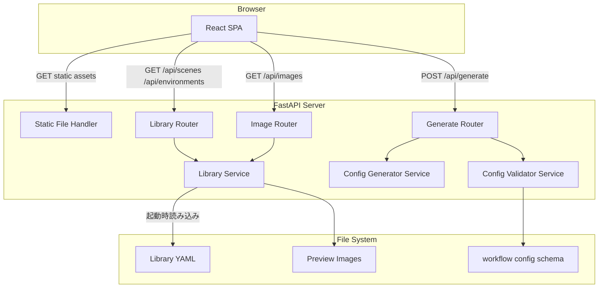
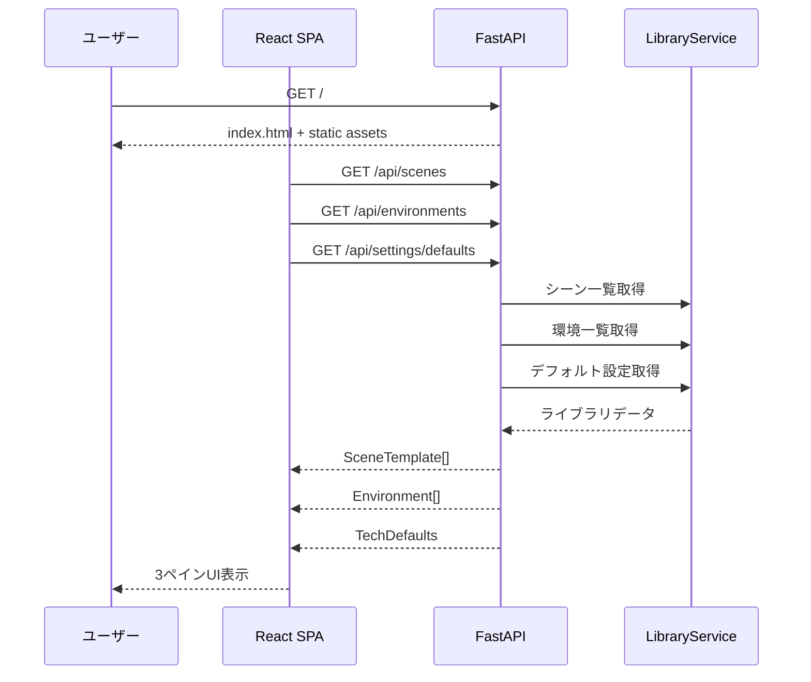
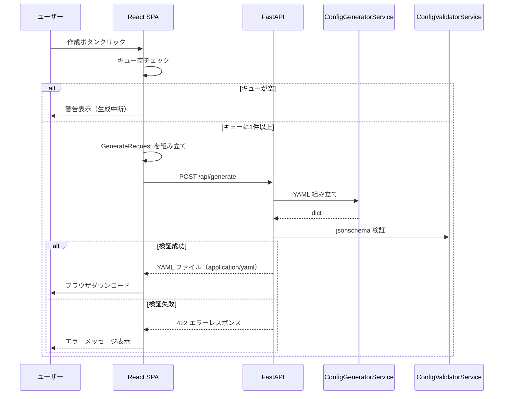

# 技術設計書

## 概要

本ドキュメントは `comfyui_prompt_maker` の技術設計を定義する。本ツールはブラウザからアクセス可能な Web アプリケーションとして動作し、ComfyUI 向けワークフローコンフィグファイル（YAML）を視覚的に構築・生成する。バックエンドは FastAPI（Python）が REST API と静的ファイル配信を単一プロセスで担い、フロントエンドは React + TypeScript SPA として実装される。

生成された YAML は `workflow_config_schema.json` に準拠し、`t2i_client_java` ツールがそのまま読み込み可能な形式で提供される。ライブラリファイル（YAML）によりシーンテンプレートおよび環境の定義を外部管理し、ツールの再ビルドなしにライブラリを更新できる。

### Goals

- ユーザーがキャラクター・環境・シーンを視覚的に選択しワークフローコンフィグを組み立てられる
- 生成されたYAMLがサーバサイドで `workflow_config_schema.json` に準拠していることを保証する
- ライブラリファイルによってシーン・環境を管理し、ツール自体の変更なく拡張できる
- 単一コマンドで起動できるシンプルな運用を実現する

### Non-Goals

- ComfyUI への直接接続・画像生成の実行
- ライブラリファイルの GUI 編集
- 複数ユーザーの同時利用・認証機能
- YAML 以外の出力フォーマット（JSON 出力は対象外）
- 生成履歴・セッション永続化

---

## アーキテクチャ

### アーキテクチャパターン & 境界マップ

採用パターン: **レイヤードアーキテクチャ**（バックエンド）+ **Context/Reducer パターン**（フロントエンド）

詳細な選定根拠は [`research.md`](./research.md) を参照。



境界の整理:
- `LibraryService` がライブラリファイルとの唯一の接点（I/O 境界）
- `ConfigValidatorService` がスキーマ検証の唯一の接点
- フロントエンドはすべての状態変更を `appReducer` 経由で行う（状態変更の一元管理）

### テクノロジースタック

| レイヤー | 選択 / バージョン | 本機能での役割 | 備考 |
|---------|----------------|-------------|------|
| Frontend | React 18 + TypeScript | SPA UI コンポーネント | Vite でビルド |
| Backend | Python 3.11+ + FastAPI 0.100+ | REST API + 静的ファイル配信 | Uvicorn ASGI サーバ |
| State Management | React Context + useReducer | フロントエンド状態の一元管理 | 外部ライブラリ不要 |
| YAML 生成 | ruamel.yaml | 出力コンフィグの YAML シリアライズ | コメント・フォーマット保持 |
| スキーマ検証 | jsonschema 4.x | 出力 YAML の JSON Schema 検証 | draft-07 対応 |
| 入力検証 | Pydantic v2 | API リクエスト/レスポンスの型安全なバリデーション | FastAPI 標準統合 |

---

## システムフロー

### フロー 1: 初期ページ読み込み・ライブラリデータ取得



### フロー 2: コンフィグ生成・ダウンロード



---

## 要件トレーサビリティ

| 要件 | サマリー | コンポーネント | インターフェース | フロー |
|-----|---------|------------|--------------|------|
| 1.1–1.3 | HTTPサーバ起動・静的配信 | AppConfig, FastAPI main | — | フロー1 |
| 2.1–2.4 | 起動設定・CLI引数 | AppConfig | AppConfig.from_args() | — |
| 3.1–3.5 | ライブラリデータ読み込み | LibraryService, LibraryLoader | LibraryService.load() | フロー1 |
| 4.1–4.5 | ライブラリ API | LibraryRouter | GET /api/scenes, /api/environments, /api/settings/defaults | フロー1 |
| 5.1–5.3 | 画像配信 | ImageRouter | GET /api/images/{path} | — |
| 6.1–6.6 | 技術設定 UI | TechSettingsPanel, AppState | TechSettingsOverrides | — |
| 7.1–7.6 | グローバル設定（左ペイン） | GlobalSettingsPanel, AppState | GlobalSettings | フロー1 |
| 8.1–8.6 | シーンライブラリ（中央ペイン） | SceneLibraryPanel, AppState | AppAction.ADD_SCENE_TO_QUEUE | フロー1 |
| 9.1–9.4 | シーンキュー（右ペイン） | SceneQueuePanel, AppState | AppAction.REMOVE_SCENE_FROM_QUEUE | — |
| 10.1–10.9 | シーン詳細編集ドロワー | SceneEditDrawer, AppState | AppAction.UPDATE_SCENE_OVERRIDE | — |
| 11.1–11.8 | コンフィグ生成・ダウンロード | GenerateRouter, ConfigGeneratorService, ConfigValidatorService | POST /api/generate | フロー2 |

---

## コンポーネントとインターフェース

### コンポーネントサマリー

| コンポーネント | レイヤー | 責務 | 要件 | 主要依存 | コントラクト |
|-------------|-------|-----|-----|---------|-----------|
| AppConfig | Backend / Infra | CLI引数・起動設定管理 | 1, 2 | — | Service |
| LibraryService | Backend / App | ライブラリデータ読み込み・保持・提供 | 3, 4, 5 | LibraryYAML, ImageFiles | Service |
| LibraryRouter | Backend / Presentation | ライブラリ系 API エンドポイント | 4, 6 | LibraryService | API |
| ImageRouter | Backend / Presentation | 画像ファイル配信 | 5 | LibraryService | API |
| ConfigGeneratorService | Backend / Domain | YAML コンフィグ組み立て | 11 | — | Service |
| ConfigValidatorService | Backend / Infra | JSON Schema 検証 | 11 | workflow_config_schema.json | Service |
| GenerateRouter | Backend / Presentation | コンフィグ生成 API | 11 | ConfigGeneratorService, ConfigValidatorService | API |
| AppState | Frontend / State | アプリ全体の状態管理（Context/Reducer） | 6–11 | — | State |
| apiClient | Frontend / Infra | バックエンド API の HTTP クライアント | 4, 5, 11 | Fetch API | Service |
| GlobalSettingsPanel | Frontend / UI | キャラクター名・環境選択（左ペイン） | 7 | AppState | — |
| TechSettingsPanel | Frontend / UI | 技術設定フォーム（左ペイン折りたたみ） | 6 | AppState | — |
| SceneLibraryPanel | Frontend / UI | シーンテンプレートカードリスト（中央ペイン） | 8 | AppState | — |
| SceneQueuePanel | Frontend / UI | 選択済みシーンキュー（右ペイン） | 9, 11 | AppState | — |
| SceneEditDrawer | Frontend / UI | シーン詳細編集ドロワー | 10 | AppState | — |

---

### Backend / Infrastructure

#### AppConfig

| フィールド | 詳細 |
|----------|-----|
| Intent | CLI 引数またはコンフィグファイルから起動設定を読み込み、アプリ全体に提供する |
| Requirements | 1.1, 1.3, 2.1, 2.2, 2.3, 2.4 |

**責務と制約**
- `--port`（デフォルト: 8080）、`--library-path`（必須またはデフォルトパス）を解析する
- 指定されたライブラリファイルの存在確認を起動時に行う
- デフォルト値は定数として管理し、コード変更なしに上書き可能にする

**Dependencies**
- Inbound: main.py — 起動時に設定読み込み（P0）
- External: argparse（Python 標準ライブラリ）— CLI 引数解析（P0）

**Contracts**: Service [x]

##### Service Interface

```python
from dataclasses import dataclass
from pathlib import Path

@dataclass(frozen=True)
class AppConfig:
    port: int
    library_path: Path

    @classmethod
    def from_args(cls, args: list[str] | None = None) -> "AppConfig":
        """CLIまたはデフォルト値からAppConfigを構築する。
        Raises:
            SystemExit: ライブラリファイルが存在しない場合
        """
        ...
```

- 事前条件: なし（起動時に呼び出す）
- 事後条件: 返された `AppConfig` の `library_path` は存在するファイルを指す
- 不変条件: `port` は 1–65535 の範囲内

**Implementation Notes**
- 起動失敗（ライブラリファイル不在）時は `sys.exit(1)` とエラーメッセージをコンソール出力
- コンフィグファイル対応は将来拡張とし、現バージョンは CLI 引数のみ実装

---

#### LibraryService

| フィールド | 詳細 |
|----------|-----|
| Intent | ライブラリ YAML を起動時に読み込み、シーン・環境・デフォルト設定・画像パスをメモリで管理する |
| Requirements | 3.1, 3.2, 3.3, 3.4, 3.5, 5.1, 5.2, 5.3 |

**責務と制約**
- 起動時に一度だけ YAML を読み込み、以降はメモリから提供する（リクエスト毎のファイルI/O なし）
- 画像ファイルパスはライブラリファイルのディレクトリを基準とした相対パスで解決する
- API レスポンス用の URL（`/api/images/{relative_path}`）に変換して保持する

**Dependencies**
- Inbound: main.py — 起動時に `load()` を呼び出し（P0）
- Inbound: LibraryRouter, ImageRouter — シーン・環境・画像データ取得（P0）
- External: ruamel.yaml — YAML パース（P0）

**Contracts**: Service [x]

##### Service Interface

```python
from pathlib import Path
from .models.library_models import LibraryScene, LibraryEnvironment, LibraryTechDefaults

class LibraryService:
    def load(self, library_path: Path) -> None:
        """ライブラリYAMLを読み込みメモリに保持する。
        Raises:
            LibraryLoadError: ファイル不在またはフォーマット不正
        """
        ...

    def get_scenes(self) -> list[LibraryScene]:
        """シーンテンプレート一覧を返す。"""
        ...

    def get_environments(self) -> list[LibraryEnvironment]:
        """環境一覧を返す。"""
        ...

    def get_tech_defaults(self) -> LibraryTechDefaults | None:
        """デフォルト技術設定を返す。未定義の場合はNone。"""
        ...

    def resolve_image_path(self, relative_path: str) -> Path | None:
        """相対パスを絶対パスに解決する。ファイルが存在しない場合はNone。"""
        ...
```

**Implementation Notes**
- `LibraryLoadError` は起動時のみ発生。API リクエスト中はデータが必ず存在する前提
- 画像ファイルが存在しない場合は `preview_image_url: null` として返し、404 は投げない（API 側で対応）

---

#### ConfigGeneratorService

| フィールド | 詳細 |
|----------|-----|
| Intent | フロントエンドから受信した `GenerateRequest` を `workflow_config_schema.json` 準拠の dict に変換する |
| Requirements | 11.1, 11.2, 11.3, 11.4, 11.5 |

**責務と制約**
- シーンに個別設定（overrides）がある場合はそれを優先し、ない場合は `default_prompts` の値をそのまま出力する
- `environment_prompt` は `character_name + " " + environment_prompt` として結合する
- None/空文字のフィールドは出力 YAML に含めない（optional フィールド）

**Dependencies**
- Inbound: GenerateRouter — 生成リクエスト処理時（P0）

**Contracts**: Service [x]

##### Service Interface

```python
from .models.api_models import GenerateRequest

class ConfigGeneratorService:
    def generate(self, request: GenerateRequest) -> dict:
        """GenerateRequestからworkflow_config_schema準拠のdictを生成する。
        Raises:
            ConfigGenerationError: シーンが空の場合など生成不可の場合
        """
        ...
```

- 事前条件: `request.scenes` が1件以上
- 事後条件: 返された `dict` が `workflow_config_schema.json` のすべての required フィールドを含む

---

#### ConfigValidatorService

| フィールド | 詳細 |
|----------|-----|
| Intent | 生成された dict が `workflow_config_schema.json` に準拠することを jsonschema で検証する |
| Requirements | 11.7 |

**Dependencies**
- Inbound: GenerateRouter（P0）
- External: jsonschema 4.x、workflow_config_schema.json（P0）

**Contracts**: Service [x]

##### Service Interface

```python
from pathlib import Path

class ConfigValidatorService:
    def __init__(self, schema_path: Path) -> None: ...

    def validate(self, config_dict: dict) -> None:
        """dictをJSONスキーマで検証する。
        Raises:
            ConfigValidationError: スキーマ違反の場合（違反内容を含む）
        """
        ...
```

---

#### API Contracts（Backend Routers）

**Contracts**: API [x]

##### Library Router

| Method | Endpoint | Request | Response | Errors |
|--------|----------|---------|----------|--------|
| GET | /api/scenes | — | `SceneTemplateResponse[]` | 500 |
| GET | /api/environments | — | `EnvironmentResponse[]` | 500 |
| GET | /api/settings/defaults | — | `TechDefaultsResponse` | 404（未設定時）, 500 |

##### Image Router

| Method | Endpoint | Request | Response | Errors |
|--------|----------|---------|----------|--------|
| GET | /api/images/{image_path:path} | — | 画像ファイル（Content-Type付き） | 404 |

##### Generate Router

| Method | Endpoint | Request | Response | Errors |
|--------|----------|---------|----------|--------|
| POST | /api/generate | `GenerateRequest` | YAML ファイル（Content-Disposition: attachment） | 400, 422, 500 |

---

### Frontend / State

#### AppState（AppContext + appReducer）

| フィールド | 詳細 |
|----------|-----|
| Intent | アプリ全体の状態を Context + useReducer パターンで一元管理し、コンポーネント間の状態共有と予測可能な状態遷移を実現する |
| Requirements | 6.3, 6.4, 6.5, 7.5, 8.4, 9.3, 10.5, 10.7, 11.1, 11.6 |

**Contracts**: State [x]

##### State Management

```typescript
// state/types.ts

interface AppState {
  // ライブラリデータ（API取得、読み取り専用）
  scenes: SceneTemplate[];
  environments: Environment[];
  techDefaults: TechDefaults | null;
  // ユーザー設定
  globalSettings: GlobalSettings;
  techSettingsOverrides: TechSettingsOverrides;
  // キュー
  sceneQueue: SceneQueueItem[];
  // UI状態
  drawerState: DrawerState;
  loadingState: LoadingState;
  error: string | null;
}

type AppAction =
  | { type: 'SET_LIBRARY_DATA'; payload: { scenes: SceneTemplate[]; environments: Environment[]; techDefaults: TechDefaults } }
  | { type: 'SET_CHARACTER_NAME'; payload: string }
  | { type: 'SELECT_ENVIRONMENT'; payload: Environment | null }
  | { type: 'UPDATE_TECH_OVERRIDE'; payload: TechSettingsOverrides }
  | { type: 'ADD_SCENE_TO_QUEUE'; payload: SceneTemplate }
  | { type: 'REMOVE_SCENE_FROM_QUEUE'; payload: string }
  | { type: 'UPDATE_SCENE_OVERRIDE'; payload: { id: string; overrides: SceneOverrides } }
  | { type: 'OPEN_DRAWER'; payload: string }
  | { type: 'CLOSE_DRAWER' }
  | { type: 'SET_LOADING'; payload: Partial<LoadingState> }
  | { type: 'SET_ERROR'; payload: string | null };
```

- 状態モデル: フラットな単一オブジェクト。ネストは最小限にとどめる
- 永続化なし: ページリロードで状態はリセットされる（セッション永続化は Non-Goals）
- 並行戦略: 単一ユーザーのみを想定。競合制御は不要

---

#### apiClient

| フィールド | 詳細 |
|----------|-----|
| Intent | バックエンド API への HTTP リクエストを型安全に抽象化し、エラーハンドリングを統一する |
| Requirements | 4.1–4.5, 5.1, 11.1, 11.2, 11.8 |

**Contracts**: Service [x]

##### Service Interface

```typescript
// api/client.ts

interface ApiClient {
  fetchScenes(): Promise<SceneTemplate[]>;
  fetchEnvironments(): Promise<Environment[]>;
  fetchTechDefaults(): Promise<TechDefaults>;
  generateConfig(request: GenerateRequest): Promise<Blob>;
}

// エラー型
class ApiError extends Error {
  constructor(
    public readonly status: number,
    public readonly message: string,
    public readonly detail?: unknown
  ) { super(message); }
}
```

- 事前条件: バックエンドサーバが起動していること
- 事後条件: 成功時は型付きレスポンスを返す。失敗時は `ApiError` を throw する
- `generateConfig` はレスポンスを `Blob` として返し、呼び出し側でダウンロードを実行する

---

### Frontend / UI（プレゼンテーションコンポーネント）

以下のコンポーネントは `AppState` のみに依存するプレゼンテーションコンポーネントであり、個別のコントラクト定義は不要。

| コンポーネント | Props の要点 | 担当要件 |
|-------------|----------|---------|
| `GlobalSettingsPanel` | `dispatch: Dispatch<AppAction>`, 状態は Context から取得 | 7.1–7.6 |
| `TechSettingsPanel` | `dispatch`, `techDefaults`, `techSettingsOverrides` | 6.1–6.6 |
| `SceneLibraryPanel` | `scenes: SceneTemplate[]`, `dispatch` | 8.1–8.6 |
| `SceneQueuePanel` | `queue: SceneQueueItem[]`, `dispatch`, `techSettings` | 9.1–9.4, 11.1, 11.6 |
| `SceneEditDrawer` | `scene: SceneQueueItem \| null`, `defaults: DefaultPrompts`, `dispatch` | 10.1–10.9 |
| `QueueCard` | `item: SceneQueueItem`, `onEdit`, `onDelete` | 9.2, 10.7, 10.8 |

**isModified** の算出: `Object.keys(item.overrides).some(k => item.overrides[k as keyof SceneOverrides] !== undefined)` で `QueueCard` が計算し、アクセントライン・バッジ表示に使用する。

---

## データモデル

### ライブラリファイルフォーマット（YAML）

`LibraryService` が読み込む外部ファイルのスキーマ定義。

```yaml
# library.yaml
# default_tech_settings: 省略可能。UIのプレースホルダとして使用される
default_tech_settings:
  comfyui_config:
    server_address: "127.0.0.1:8188"
    client_id: "t2i_client"
  workflow_config:
    workflow_json_path: "/path/to/workflow.json"
    image_output_path: "/path/to/output"
    library_file_path: "/path/to/library.yaml"
    seed_node_id: 164
    batch_size_node_id: 22
    negative_prompt_node_id: 174
    positive_prompt_node_id: 257
    environment_prompt_node_id: 303
    default_prompts:
      base_positive_prompt: "masterpiece, best quality"
      environment_prompt: ""
      positive_prompt: ""
      negative_prompt: "lowres, bad anatomy"
      batch_size: 1

environments:
  - name: "indoor"            # 識別ID（機械可読）
    display_name: "室内"       # UI表示名
    environment_prompt: "indoor room, soft lighting"
    thumbnail: "thumbnails/indoor.jpg"  # ライブラリファイルからの相対パス（省略可）

scenes:
  - name: "studying"
    display_name: "勉強しているシーン"
    positive_prompt: "sitting at desk, studying, reading book"
    negative_prompt: ""
    batch_size: 1
    preview_image: "scenes/studying.jpg"  # 省略可
```

### APIデータ型（TypeScript / Pydantic 共通定義）

```typescript
// types/scene.ts
interface SceneTemplate {
  name: string;
  displayName: string;
  positivePrompt: string;
  negativePrompt: string;
  batchSize: number;
  previewImageUrl: string | null;
}

interface SceneOverrides {
  name?: string;
  positivePrompt?: string;
  negativePrompt?: string;
  batchSize?: number;
}

interface SceneQueueItem {
  id: string;           // クライアント生成UUID
  templateName: string;
  displayName: string;
  overrides: SceneOverrides;
}

// types/environment.ts
interface Environment {
  name: string;
  displayName: string;
  environmentPrompt: string;
  thumbnailUrl: string | null;
}

// types/settings.ts
interface ComfyUIConfig {
  serverAddress: string;
  clientId: string;
}

interface WorkflowConfigParams {
  workflowJsonPath: string;
  imageOutputPath: string;
  libraryFilePath: string;
  seedNodeId: number;
  batchSizeNodeId: number;
  negativePromptNodeId: number;
  positivePromptNodeId: number;
  environmentPromptNodeId: number;
  defaultPrompts: DefaultPrompts;
}

interface DefaultPrompts {
  basePositivePrompt: string;
  environmentPrompt: string;
  positivePrompt: string;
  negativePrompt: string;
  batchSize: number;
}

interface TechDefaults {
  comfyuiConfig: ComfyUIConfig;
  workflowConfig: WorkflowConfigParams;
}

type TechSettingsOverrides = {
  comfyuiConfig: Partial<ComfyUIConfig>;
  workflowConfig: Partial<WorkflowConfigParams>;
};

// types/api.ts
interface GenerateRequest {
  globalSettings: {
    characterName: string;
    environmentName: string;
    environmentPrompt: string;
  };
  techSettings: {
    comfyuiConfig: ComfyUIConfig;
    workflowConfig: WorkflowConfigParams;
  };
  scenes: Array<{
    templateName: string;
    overrides: SceneOverrides;
  }>;
}
```

### ドメインモデル（バックエンド Pydantic）

```python
# models/library_models.py
class LibraryScene(BaseModel):
    name: str
    display_name: str
    positive_prompt: str
    negative_prompt: str = ""
    batch_size: int = Field(default=1, ge=1)
    preview_image: str | None = None

class LibraryEnvironment(BaseModel):
    name: str
    display_name: str
    environment_prompt: str
    thumbnail: str | None = None

class LibraryTechDefaults(BaseModel):
    comfyui_config: ComfyUIConfigModel
    workflow_config: WorkflowConfigParamsModel

class LibraryFile(BaseModel):
    scenes: list[LibraryScene]
    environments: list[LibraryEnvironment]
    default_tech_settings: LibraryTechDefaults | None = None

# models/api_models.py
class SceneTemplateResponse(BaseModel):
    name: str
    display_name: str
    positive_prompt: str
    negative_prompt: str
    batch_size: int
    preview_image_url: str | None

class EnvironmentResponse(BaseModel):
    name: str
    display_name: str
    environment_prompt: str
    thumbnail_url: str | None

class TechDefaultsResponse(BaseModel):
    comfyui_config: ComfyUIConfigModel
    workflow_config: WorkflowConfigParamsModel

class SceneOverrides(BaseModel):
    name: str | None = None
    positive_prompt: str | None = None
    negative_prompt: str | None = None
    batch_size: int | None = Field(default=None, ge=1)

class GenerateSceneItem(BaseModel):
    template_name: str
    overrides: SceneOverrides

class GenerateRequest(BaseModel):
    global_settings: GlobalSettingsPayload
    tech_settings: TechSettingsPayload
    scenes: list[GenerateSceneItem] = Field(min_length=1)
```

---

## エラーハンドリング

### エラー戦略

バックエンドはエラーを HTTP ステータスコードで分類し、フロントエンドは `ApiError` を補足して UI にフィードバックする。ライブラリ読み込みエラーは起動時にのみ発生し、プロセスを終了する。

### エラー分類とレスポンス

**ユーザーエラー (4xx)**
- `400 Bad Request`: シーンキューが空で生成を要求 → "シーンを1件以上追加してください" とフロントエンドでバリデーション（POST 前に防止）
- `404 Not Found`: 画像ファイルが存在しない → フロントエンドはフォールバック画像を表示
- `422 Unprocessable Entity`: JSON Schema 検証失敗 → 違反内容をレスポンスボディに含めてフロントエンドに表示

**システムエラー (5xx)**
- `500 Internal Server Error`: ライブラリデータ未ロード・予期しない例外 → フロントエンドに汎用エラーメッセージ表示

**起動時エラー（致命的）**
- ライブラリファイル不在: コンソールエラー出力 → `sys.exit(1)`
- ライブラリ YAML フォーマット不正: バリデーションエラー内容をコンソール出力 → `sys.exit(1)`

### モニタリング

- バックエンド: uvicorn のアクセスログ（標準出力）でリクエスト/エラーを確認
- フロントエンド: `ApiError` をコンソールに出力し、UI にユーザー向けメッセージを表示

---

## テスト戦略

### ユニットテスト（バックエンド）

- `ConfigGeneratorService.generate()`: シーンにオーバーライドがある場合・ない場合の出力 dict を検証
- `ConfigValidatorService.validate()`: 正常な dict・必須フィールド欠損・型違反での動作を検証
- `LibraryService.load()`: 正常な YAML・フォーマット不正・ファイル不在の動作を検証
- `AppConfig.from_args()`: 引数あり・なし・ファイル不在の動作を検証

### ユニットテスト（フロントエンド）

- `appReducer`: 各 `AppAction` ごとの状態遷移を検証
- `apiClient`: モックサーバを使用して各エンドポイントの成功・失敗を検証

### 統合テスト

- `GET /api/scenes` → `LibraryService` → YAML ファイルの往復テスト
- `POST /api/generate` → `ConfigGeneratorService` → `ConfigValidatorService` → YAML レスポンスの往復テスト
- ライブラリ YAML に画像パスがある場合の `GET /api/images/{path}` 配信テスト

### E2E テスト

- ページ読み込み → シーンライブラリ表示確認
- シーンを選択 → キューへ追加 → ドロワーで編集 → 作成ボタンクリック → YAML ダウンロード確認
- キューが空の状態で作成ボタンクリック → 警告表示確認

---

## ディレクトリ構成

```
comfyui_prompt_maker/
├── backend/
│   ├── main.py                    # FastAPI アプリ定義・起動エントリポイント
│   ├── app_config.py              # AppConfig（CLI引数解析）
│   ├── models/
│   │   ├── library_models.py      # LibraryFile, LibraryScene, LibraryEnvironment 等
│   │   └── api_models.py          # API リクエスト/レスポンス Pydantic モデル
│   ├── services/
│   │   ├── library_service.py     # LibraryService
│   │   ├── config_generator.py    # ConfigGeneratorService
│   │   └── config_validator.py    # ConfigValidatorService
│   └── routers/
│       ├── library_router.py      # GET /api/scenes, /api/environments, /api/settings/defaults
│       ├── image_router.py        # GET /api/images/{path}
│       └── generate_router.py     # POST /api/generate
├── frontend/
│   ├── index.html
│   ├── vite.config.ts
│   ├── tsconfig.json
│   └── src/
│       ├── main.tsx
│       ├── App.tsx
│       ├── types/
│       │   ├── scene.ts
│       │   ├── environment.ts
│       │   └── settings.ts
│       ├── state/
│       │   ├── AppContext.tsx
│       │   ├── reducer.ts
│       │   └── initialState.ts
│       ├── hooks/
│       │   └── useLibraryData.ts
│       ├── api/
│       │   └── client.ts
│       └── components/
│           ├── GlobalSettingsPanel/
│           ├── TechSettingsPanel/
│           ├── SceneLibraryPanel/
│           ├── SceneQueuePanel/
│           └── SceneEditDrawer/
├── docs/                          # 既存ドキュメント
├── requirements.txt               # Python依存関係
└── package.json                   # フロントエンド依存関係
```
