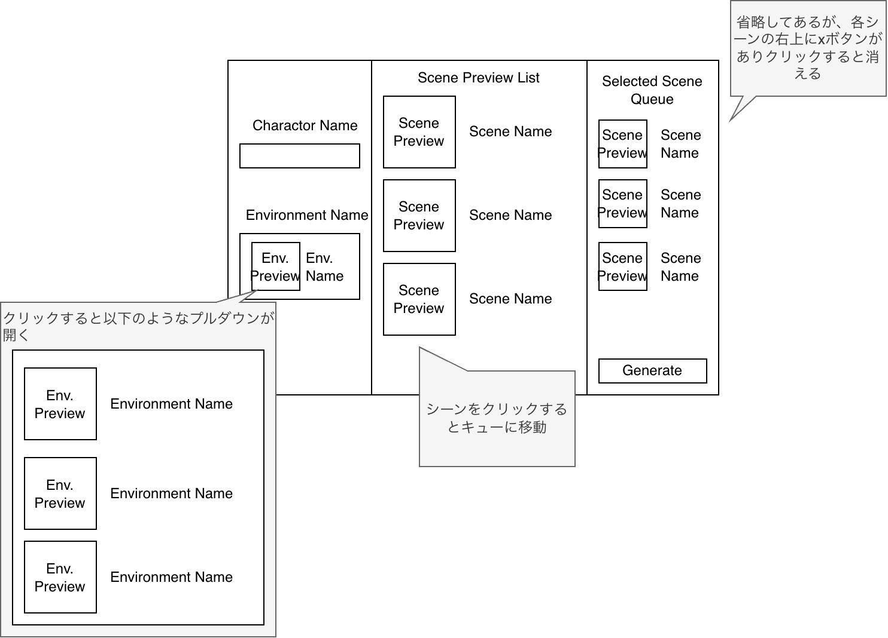
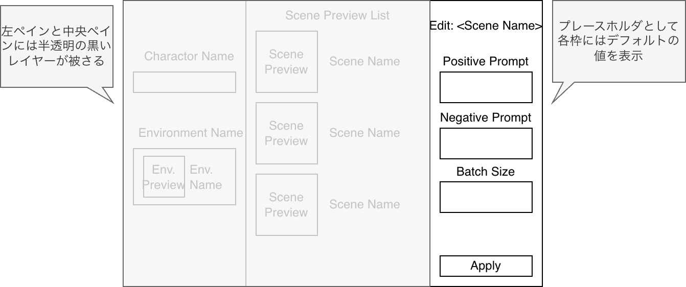
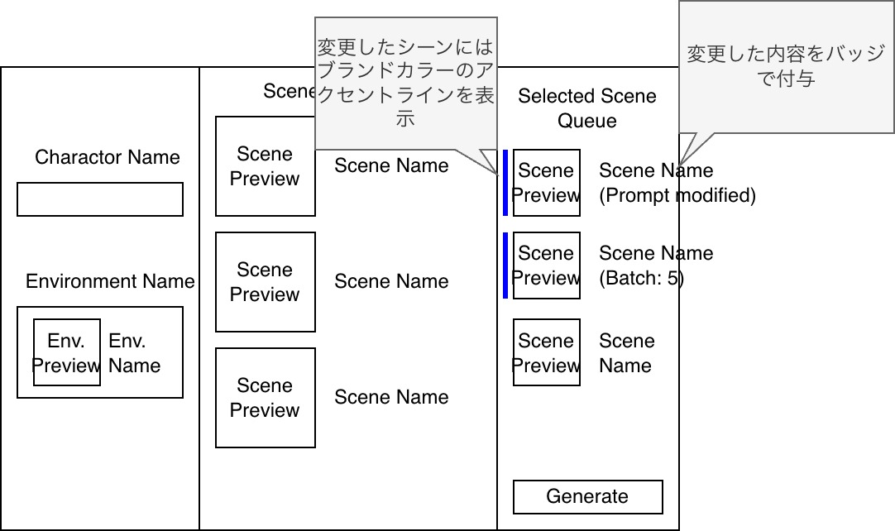

# 概要
本システムはcomfyuiで一連の画像を生成するための、ワークフローコンフィグファイルを作成するためのツールである。このシステムで作成するコンフィグファイルは[t2i_client_javaツール](https://github.com/uS-aito/t2i_client_java)で読み込まれ、comfyuiを使用して一連の画像の生成に使用される。

# 仕様
## 本ツールについて
本ツールはWebアプリとして動作する。本ツールを起動するとHTTPサーバが起動し、そのサーバにアクセスすることでブラウザ上でツールが表示される。

## コンフィグファイルについて
本システムの出力するコンフィグファイルのフォーマットは[workflow_config_schema.json](./workflow_config_schema.json)で定義されている。また実際のコンフィグファイルのサンプルは[sample_workflow_config.yaml](./sample_workflow_config.yaml)にある。

このコンフィグファイルはt2i_client_javaツールが読み込むことができ、コンフィグファイル内で指定されたプロンプトをもとに、各シーンの画像生成を行う。

## UI設計仕様書

### 1. 概要
本ツールは、ComfyUIで一連の画像を生成するためのワークフローコンフィグファイル（JSON/YAML）を直感的に作成するためのWebアプリケーションです。ユーザーはキャラクターや環境、シーンを視覚的に選択し、個別の詳細調整を行った上で、生成用コンフィグを出力できます。

### 2. 画面構成
画面は大きく分けて3つのメインペインと、詳細編集用のドロワー（サイドパネル）で構成されます。

#### 2.1. 左ペイン：グローバル設定エリア
全シーンに共通する基本的なプロンプト要素を管理します。
* **キャラクター名入力**
    * **形式**: テキスト入力ボックス。
    * **用途**: シーン全体のベースとなるキャラクター識別名。
* **環境名選択**
    * **形式**: サムネイル付き選択リスト（入力欄クリックでプルダウン展開）。
    * **用途**: `default_prompts` 内の `environment_prompt` として全シーンに適用される。
    * **仕様**: 「室内」「森」などのプリセットを画像で確認しながら選択可能。

#### 2.2. 中央ペイン：シーンライブラリ
追加可能なシーンのテンプレートを選択するエリアです。
* **シーンリスト**
    * **形式**: 垂直スクロール可能なカードリスト。
    * **構成**: シーンのプレビュー画像とシーン名。
    * **操作**: シーンをクリックすることで、右ペインの「選択済みシーン（キュー）」へ追加される。

#### 2.3. 右ペイン：選択済みシーン（キュー）
生成対象として確定したシーンを管理・一覧表示します。
* **シーンカード**
    * **表示内容**: シーン名、現在のバッチサイズ等のステータスバッジ。
    * **操作**:
        * カードをクリック：詳細編集ドロワーを展開。
        * 削除ボタン（×）：キューから該当シーンを除去。
* **作成（Generate）ボタン**
    * **配置**: キューエリアの最下部に固定。
    * **動作**: 現在の設定値を反映した `workflow_config_schema.json` 準拠のファイルを出力する。

### 2.4. 詳細編集ドロワー（サイドパネル）
右ペイン（キュー）で選択された個別シーンのプロンプトやバッチサイズを詳細に調整するためのエリアです。ここでの編集内容は、キュー内のシーンカードへ即座に視覚的なフィードバックとして反映されます。

* **表示形式（オーバーレイ方式）**
    * **トリガー**: 右ペインのシーンカードをクリックした際に、画面右端からスライドインして表示されます。
    * **表示範囲**: 右ペイン（選択済みシーンのキュー）を完全に覆う、あるいはその上に重なる形で表示されます。
    * **フォーカス効果**: ドロワー表示中は、左ペインおよび中央ペインの上に半透明の黒いレイヤー（オーバーレイ）を被せ、ユーザーの視点を詳細編集作業に集中させます。
    * **タイトル**: ドロワー上部には「シーン名：[選択したシーン名] の編集」と表示し、編集対象を明示します。

* **データの保存と反映（オートセーブ）**
    * **保存タイミング**: 入力項目（テキストエリアや数値入力）の変更は即座にメモリ上の設定に反映（オートセーブ）されます。
    * **継承の可視化**: 個別の入力がない項目は、左ペインで設定した共通設定（`default_prompts`）の値をプレースホルダとして薄く表示します。ユーザーが値を入力した時点で、そのシーン固有の上書き設定（Override）として扱われます。

* **編集済みステータスの視覚的フィードバック**
    ドロワーでの編集が行われると、キュー内の該当シーンカードに対して以下の視覚効果がリアルタイムで適用されます。
    * **アクセントラインの表示**: 
        * カードの左端に、ブランドカラー（例：鮮やかな青や紫）の垂直ライン（幅約4px）を表示します。
        * これにより、リスト全体の中でどのシーンがデフォルト設定から変更されているかを瞬時に判別可能にします。
    * **変更項目バッジの付与**:
        * カードの下部に、変更された項目を示す小さなラベル（バッジ）を表示します。
        * 例：「Prompt Modified」「Batch: 5」など。
        * これにより、ドロワーを開かなくても「何が変更されたか」を把握できるようにします。

* **閉じる操作**
    以下のいずれかの操作でドロワーを閉じ、メインの編集画面に戻ることができます。
    1.  **閉じるボタン**: ドロワー上部に配置された「×」アイコンをクリック。
    2.  **背景クリック**: ドロワー以外の暗転しているエリアをクリック。
    3.  **完了ボタン**: ドロワー最下部に配置されたボタンをクリック。

* **編集項目（スキーマ準拠）**
    * **シーン名 (`name`)**: シーンを識別するためのテキスト入力。
    * **ポジティブプロンプト (`positive_prompt`)**: 詳細な指示を入力する広めのテキストエリア。
    * **ネガティブプロンプト (`negative_prompt`)**: 除外設定を入力するテキストエリア。
    * **バッチサイズ (`batch_size`)**: 数値入力（スピンボタン）。

### 3. 画面遷移イメージ図
1. 初期画面

2. サイドパネル展開

3. 編集後

### 4. データマッピング仕様
UIでの操作結果は、以下の通り出力ファイルの各項目へマッピングされます。

| UI要素 | 対応するスキーマ項目 (`workflow_config_schema.json`) |
| :--- | :--- |
| キャラクター名/環境名 | `workflow_config.default_prompts.environment_prompt` |
| 中央ペインでの選択 | `scenes` 配列への新規オブジェクト追加 |
| 詳細ドロワーでの編集 | `scenes[i]` 内の各プロパティ（`positive_prompt` 等）の上書き |
| バッチサイズ（既定） | `workflow_config.default_prompts.batch_size` |
